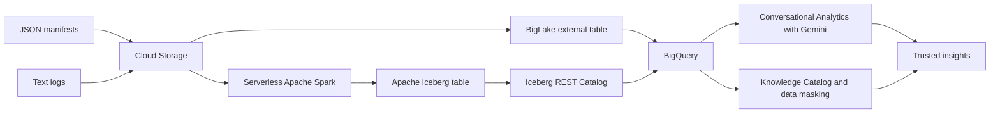

# Open Data Lakehouse in Action: A Governed Logistics Investigation

An independent educational implementation showing how structured shipping manifests and unstructured maritime logs can be ingested, processed, queried, explored with AI, and governed on Google Cloud.

> This repository is inspired by the public Google Codelab “Lab 1: Ingest and Govern Logistics Data.” It uses original explanations, parameterized templates, and synthetic sample data. It is not an official Google Cloud reference architecture.

## Architecture




## What the implementation demonstrates

1. Query newline-delimited JSON in Cloud Storage through a BigLake external table.
2. Identify records with failed seal-integrity checks using BigQuery SQL.
3. Parse synthetic transponder logs with PySpark.
4. Write normalized records to Apache Iceberg through a REST catalog.
5. Query the cataloged Iceberg table from BigQuery.
6. Extract a route destination from processed messages.
7. Validate column-level masking for a sensitive custodian identifier.

## Repository contents

```text
sql/          BigQuery investigation and validation queries
spark/        PySpark parsing and Iceberg write template
scripts/      Environment, upload, Spark submission, and cleanup helpers
sample_data/  Synthetic JSONL and text inputs
tests/        Local parser check
docs/         Implementation and governance guidance
architecture/ Architecture visual
screenshots/  Your redacted implementation evidence
```

## Quick start

```bash
git clone YOUR_GITHUB_URL
cd open-data-lakehouse-logistics
make check
```

Then follow `docs/implementation-guide.md` and replace every placeholder before running cloud commands:

```bash
make placeholders
```

## Products

- BigQuery and BigLake external tables
- Cloud Storage
- Google Cloud Managed Service for Apache Spark
- Apache Iceberg and the Lakehouse Iceberg REST Catalog
- Conversational Analytics powered by Gemini
- Knowledge Catalog, policy tags, and data masking
- Google Cloud Data Agent Kit extension

## Security and cost

Use a temporary project and synthetic data. Never commit `.env` files, account keys, access tokens, billing data, or real sensitive identifiers. Review `SECURITY.md` and `docs/cost-and-cleanup.md` before execution.

## Author

Dr. Roushanak Rahmat, Google Developer Expert, Cloud

## Reference

https://codelabs.developers.google.com/data-roadshow-26/lab1

## License

Apache License 2.0. See `LICENSE`.
