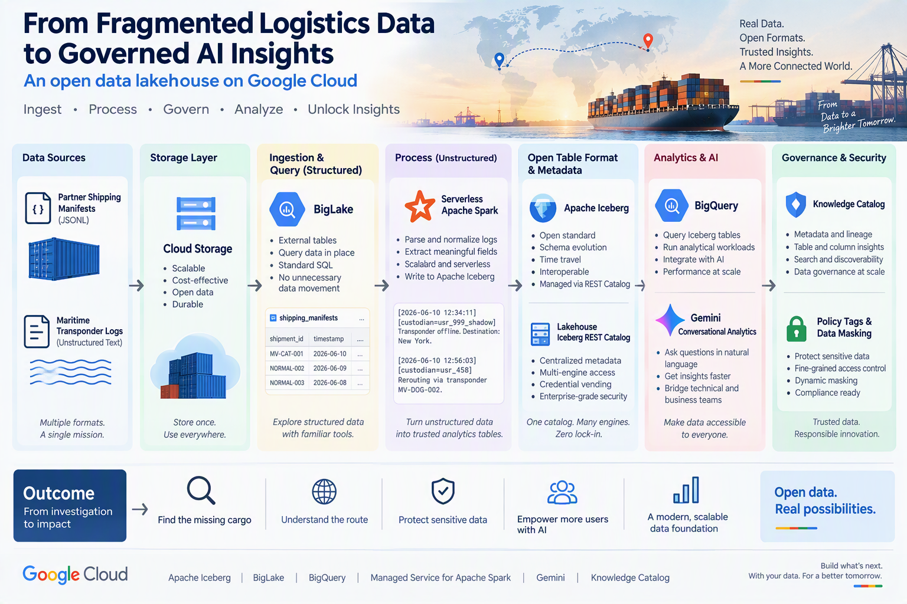

# Open Data Lakehouse Logistics

A governed open data lakehouse implementation for investigating structured and unstructured logistics data using BigLake, BigQuery, Google Cloud Managed Service for Apache Spark, Apache Iceberg, Gemini, and Knowledge Catalog.

[](https://medium.com/@roushanakrahmat/from-fragmented-logistics-data-to-governed-ai-insights-with-google-clouds-open-lakehouse-ba1594fdc131)

## Architecture



The workflow brings together two forms of logistics evidence:

1. JSON shipping manifests are queried through a BigLake external table.
2. Unstructured maritime logs are processed with serverless Apache Spark.
3. Spark writes the normalized result as an Apache Iceberg table through the Lakehouse Iceberg REST Catalog.
4. BigQuery queries the cataloged Iceberg data.
5. Conversational Analytics powered by Gemini supports natural-language exploration.
6. Knowledge Catalog, policy tags, and data masking protect sensitive custodian identifiers.

## Repository structure

```text
.
├── assets/
│   └── open-data-lakehouse-logistics.png
├── sample_data/
│   ├── manifests.jsonl
│   └── maritime_logs.txt
├── scripts/
│   ├── configure_environment.sh
│   ├── upload_sample_data.sh
│   ├── submit_spark_batch.sh
│   └── cleanup.sh
├── spark/
│   └── process_maritime_logs.py
├── sql/
│   ├── 01_create_external_table.sql
│   ├── 02_find_compromised_shipments.sql
│   ├── 03_preview_iceberg_logs.sql
│   ├── 04_extract_destination.sql
│   └── 05_verify_masking.sql
├── .gitignore
├── LICENSE
└── README.md
```

## Prerequisites

- A Google Cloud project with billing enabled
- Google Cloud CLI access
- Permission to create Cloud Storage, BigQuery, BigLake, Dataproc Serverless, and Knowledge Catalog resources
- A consistent supported region for all resources
- Basic SQL, Python, and shell familiarity

## Quick start

### 1. Configure the environment

Edit `scripts/configure_environment.sh`, replace `YOUR_PROJECT_ID`, and run:

```bash
source scripts/configure_environment.sh
```

### 2. Create the platform resources

Create the following resources in compatible locations:

- Cloud Storage bucket
- BigQuery dataset
- BigQuery connection
- Lakehouse Iceberg REST Catalog
- Iceberg namespace
- Required IAM permissions

### 3. Upload the synthetic sample data

```bash
scripts/upload_sample_data.sh
```

### 4. Create and query the BigLake external table

Run these files in BigQuery:

```text
sql/01_create_external_table.sql
sql/02_find_compromised_shipments.sql
```

### 5. Process the unstructured logs

```bash
scripts/submit_spark_batch.sh
```

### 6. Query the Iceberg table

Run:

```text
sql/03_preview_iceberg_logs.sql
sql/04_extract_destination.sql
```

### 7. Apply and verify data masking

Create a policy tag for `custodian_id`, configure a nullification masking rule, and run:

```text
sql/05_verify_masking.sql
```

For a masked reader, `shipment_id` should remain visible while `custodian_id` returns `NULL`.

## Key design principles

- **Open and interoperable:** Apache Iceberg provides a shared table foundation across processing engines.
- **Reduced data movement:** BigLake enables analysis of data stored in Cloud Storage without an initial ingestion copy.
- **Complementary engines:** Spark handles flexible text processing, while BigQuery provides SQL analytics.
- **AI on governed data:** Gemini-assisted exploration sits on top of documented and protected data.
- **Testable governance:** The masking query provides an observable security acceptance test.

## Important notes

This repository is an educational implementation, not a production reference architecture or performance benchmark. Production deployments require independent decisions covering IAM, networking, encryption, data quality, observability, retention, recovery, Iceberg maintenance, cost controls, and regulatory requirements.

Never commit credentials, access tokens, project secrets, billing information, or real sensitive data.

## Cleanup

Review `scripts/cleanup.sh` before running it. Confirm that temporary datasets, buckets, Spark resources, Iceberg objects, connections, policy tags, and IAM bindings are removed when no longer needed.

## Article

Read the complete architectural discussion:

[From Fragmented Logistics Data to Governed AI Insights with Google Cloud’s Open Lakehouse](https://medium.com/@roushanakrahmat/from-fragmented-logistics-data-to-governed-ai-insights-with-google-clouds-open-lakehouse-ba1594fdc131)

## Attribution

This independent educational project was inspired by the public Google Codelab [Lab 1: Ingest and Govern Logistics Data](https://codelabs.developers.google.com/data-roadshow-26/lab1). The repository uses original explanations, parameterized templates, and synthetic sample data.

## Author

**Dr. Roushanak Rahmat**  
Google Developer Expert, Cloud

## License

Licensed under the Apache License 2.0. See [LICENSE](LICENSE).
